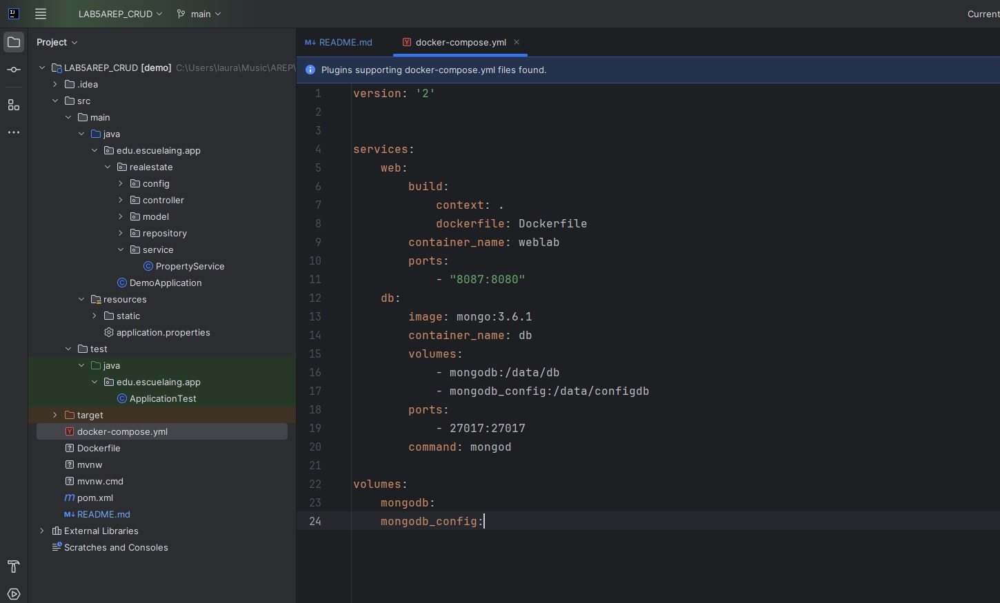
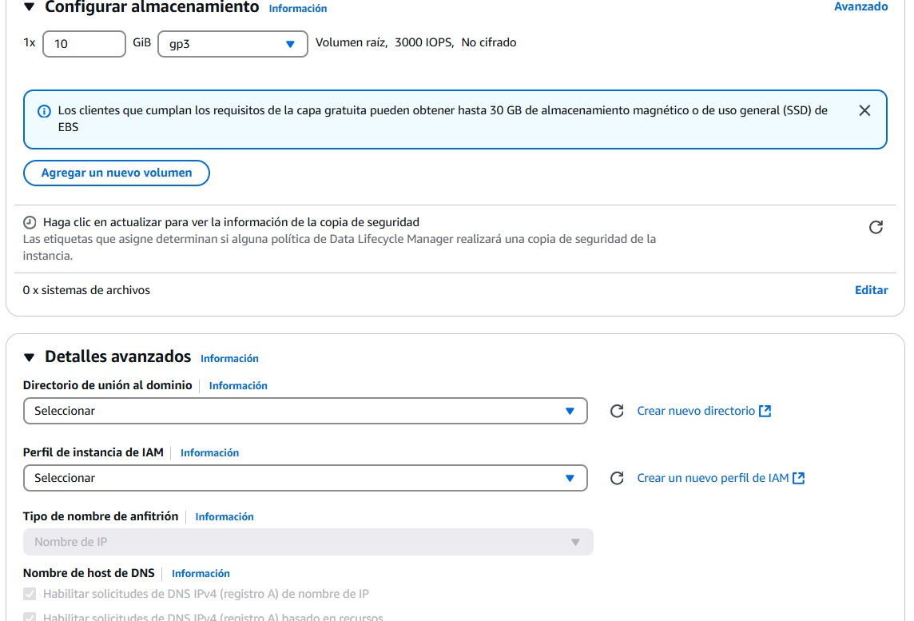
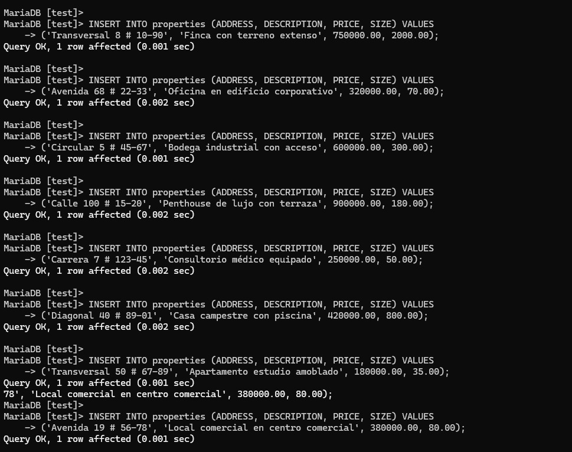
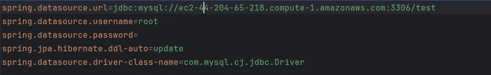
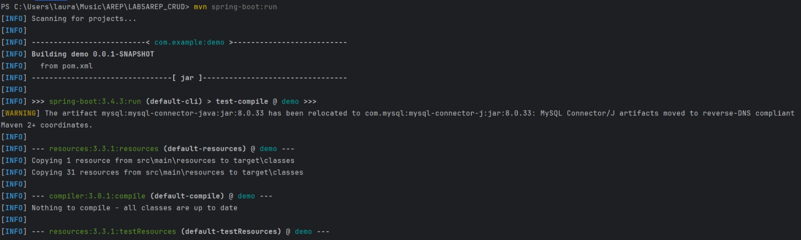
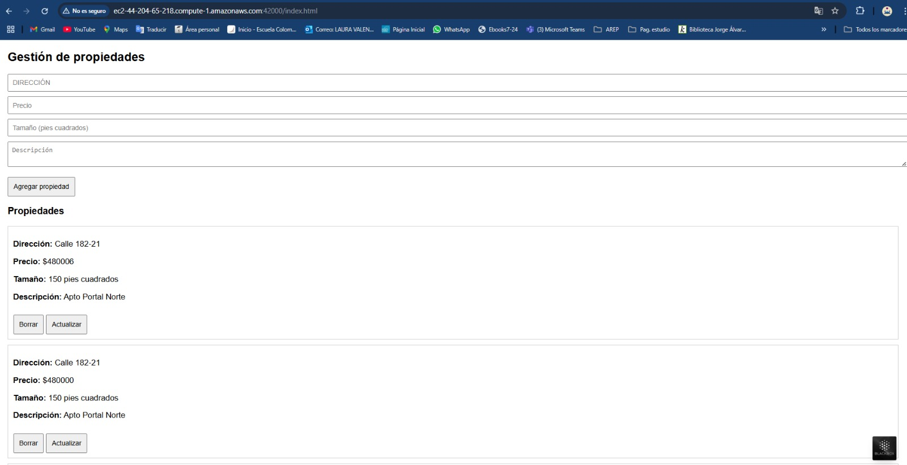
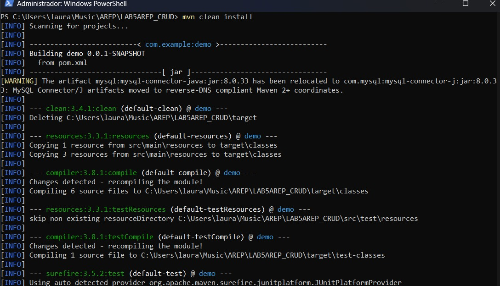

# Lab5 AREP

## Comenzando

Se debe clonar el proyecto localmente con el comando:

` git clone https://github.com/lalaro/LAB5AREP_CRUD.git`

Y luego revisar las intrucciones a continuación para el manejo de soluciones del proyecto.

### Prerrequisitos

Se necesita de Maven (La versión más reciente), IntelliJ, Docker, Spring Boot Git bash y Java 21, la instalación debe realizarse desde las paginas oficiales de cada programa.

### Instalación

Para Maven debe irse a https://maven.apache.org/download.cgi, descargar la versión más nueva que allá de Maven (En este caso tenemos la versión 3.9.6) y agregarse en la carpeta de Program Files, luego se hace la respectiva configuración de variables de entorno según la ubicación que tenemos para el archivo de instalación, tanto de MAVEN_HOME y de Path.
Luego revisamos que haya quedado bien configurado con el comando para Windows:

` mvn - v `
o
` mvn -version `

Para Java debe irse a https://www.oracle.com/java/technologies/downloads/?er=221886, descargar la versión 21 de Java y agregarse en la carpeta de Program Files, luego se hace la respectiva configuración de variables de entorno según la ubicación que tenemos para el archivo de instalación, tanto de JAVA_HOME y de Path.
Luego revisamos que haya quedado bien configurado con el comando para Windows:

` java -version `

Si no tenemos la versión solicitada podemos hacer lo siguiente, para el caso de Windows:

Ir al Windows PowerShell y ejecutar como administrador los siguientes codigos:

` [System.Environment]::SetEnvironmentVariable("JAVA_HOME", "C:\Program Files\Java\jdk-21", [System.EnvironmentVariableTarget]::Machine) `

Revisar las rutas de la máquina

`  $env:JAVA_HOME = "C:\Program Files\Java\jdk-21" `

`  $env:Path = "C:\Program Files\Java\jdk-21\bin;" + $env:Path `

`  echo $env:JAVA_HOME `

`  javac -version `

`  java -version `

Así se debe ver:

## Solución del lab

Un sistema CRUD funcional que permite a los usuarios administrar listados de propiedades implementados en AWS

### *Resumen del proyecto:*

Este proyecto implementa una aplicación CRUD (Crear, Leer, Actualizar, Borrar) para la gestión de propiedades, desplegada en la infraestructura de AWS. La base de datos, se instaló y configuró directamente en una instancia EC2 de AWS. La aplicación, desarrollada en Java con Spring Boot, se dockerizó para facilitar su despliegue y escalabilidad. La imagen Docker resultante se desplegó en otra instancia EC2, configurando los puertos y la conectividad necesarios para interactuar con la base de datos remota. La interfaz de usuario, construida con HTML, CSS y JavaScript, permite a los usuarios realizar operaciones CRUD a través de una API RESTful, comunicándose con el backend dockerizado.

### *Arquitectura del sistema:*

### *Diseño de clases:*

Esta aplicación usa CorsConfig para permitir que el frontend acceda a la API. Sin esto, el navegador bloquearía las peticiones. Permite el acceso desde otros dominios.

El PropertyController recibe las peticiones HTTP de los clientes. Coordina las operaciones CRUD. Usa el servicio para procesar las peticiones y devuelve respuestas.

Esta aplicación usa Property para definir un inmueble. Dentro del CRUD, es el modelo de datos. Define qué información se guarda de cada inmueble.

El PropertyRepository conecta la app con la base de datos. Permite hacer operaciones CRUD en los inmuebles sin escribir SQL. Facilita guardar y obtener datos.

Esta aplicación usa PropertyService para la lógica de los inmuebles. Es la capa entre el controlador y el repositorio. Procesa datos y llama al repositorio para el CRUD.

El archivo index.html define la estructura de la interfaz de usuario, incluyendo formularios para agregar y actualizar propiedades, y áreas para mostrar la lista de propiedades. El archivo script.js contiene la lógica de JavaScript que interactúa con la API RESTful, enviando y recibiendo datos para realizar las operaciones CRUD y actualizando dinámicamente la interfaz de usuario. Finalmente, el archivo style.css proporciona estilos básicos para mejorar la presentación de la página web, asegurando que los elementos estén dispuestos de manera clara y legible para el usuario.

Configuración de la Base de datos que tenemos en AWS:

Este Dockerfile crea una imagen para ejecutar una aplicación Java, usando OpenJDK 21 como base. Copia las clases compiladas y las dependencias de la aplicación a un directorio dentro del contenedor, define el puerto de la aplicación como 6000, copia los archivos estáticos a una ruta dentro del contenedor y luego ejecuta la aplicación Java usando el classpath apropiado.

Este docker-compose.yml configura dos servicios: una aplicación web construida desde un Dockerfile local y una base de datos MongoDB. Define puertos y volúmenes para ambos contenedores, permitiendo que la aplicación web se comunique con la base de datos y que los datos de la base de datos persistan.

### *Instrucciones de implementación:*

1. **Primero es necesario, crear una nueva instancia EC2 en AWS, para poder contener la BD.**

2. **Como segundo paso, es fundamental instalar la base de datos que se va a usar en nuestra instancia EC2.**

    Aclaración: Debido a problemas con la instalación de MySQL en la instancia, donde paquetes corruptos impedían la finalización, opté por MariaDB. Su compatibilidad casi total con MySQL simplifica la configuración y garantiza una funcionalidad similar.

3. **Luego, conectamos la bd a nuestro proyecto spring-boot y revisamos que funcione localmente.**

Hay que tener en cuenta que DNS de IP4 pública, va cambiar cada que se inicialice la instancia:

4. **Verificamos en tiempo real que la BD se actualice cada vez que se cree, consulte, actualice o elimine algun dato.**

5. **Como quinto paso dockerizamos el proyecto de Spring-boot del CRUD.**

` java -cp "target\classes;target\dependency\*" edu.escuelaing.app.DemoApplication `

6. **Conectamos la imagen a la instancia EC2, que ya se había creado en el lab 4.**

7. **Corremos nuestras dos instancias al tiempo database_lala y DockerWebApp.**

8. **Verificamos que la bd traiga los datos correspondientes a nuestro despliegue de AWS.**

### *Capturas de pantalla:*

Ejecución localmente:

Ejecución dockerizada:

Ejecución desplegada en AWS:

### *Video:*

## Ejecutando las pruebas

Podemos Abrir en terminal el proyecto y ejecutar las pruebas desde el PowerShell, en el caso de Windows. Y ejecutamos el comando:

` mvn test `

O de igual forma en el ID que deseemos.

Así se vera:

### Desglose en pruebas de extremo a extremo

### Y pruebas de estilo de código

## Despliegue

Podemos Abrir en terminal el proyecto y compilar y empaquetar el proyecto desde el PowerShell, en el caso de Windows. Y ejecutamos los comandos:

` mvn clean install `

` mvn spring-boot:run `

O de igual forma en el ID que deseemos.

Así se vera:

## Construido con

* [Maven](https://maven.apache.org/) - Gestión de dependencias.
* [Java](https://www.java.com/es/) - Versionamiento en Java.
* [GitHub](https://docs.github.com/es) - Sistema de control de versiones distribuido.
* [IntelliJ](https://www.jetbrains.com/es-es/idea/) - Entorno de desarrollo integrado.
* [AWS](https://docs.aws.amazon.com/es_es/) - Amazon Web Services / plataforma de servicios de nube.
* [Docker](https://docs.docker.com/) - Tecnología en contenedores que permite crear y usar contenedores Linux.
* [Spring Boot](https://docs.spring.io/spring-boot/index.html) -Herramienta de código abierto para desarrollar aplicaciones web y microservicios en Java

## Contribuyendo

Por favor, lee [CONTRIBUTING.md](https://gist.github.com/PurpleBooth/b24679402957c63ec426) para detalles sobre nuestro código de conducta y el proceso para enviarnos solicitudes de cambios (*pull requests*).

## Versionado

Usamos [SemVer](http://semver.org/) para el versionado.

## Autores

* **Laura Valentina Rodríguez Ortegón** - *Lab5 AREP* - [Repositorio](https://github.com/lalaro/LAB5AREP_CRUD.git)

## Licencia

Este proyecto está licenciado bajo la Licencia MIT - consulta el archivo [LICENSE.md](LICENSE.md) para más detalles.

## Reconocimientos

* Agradecimientos a la Escuela Colombiana de Ingeniería
* La documentación de Git Hub
* Al profesor Luis Daniel Benavides
